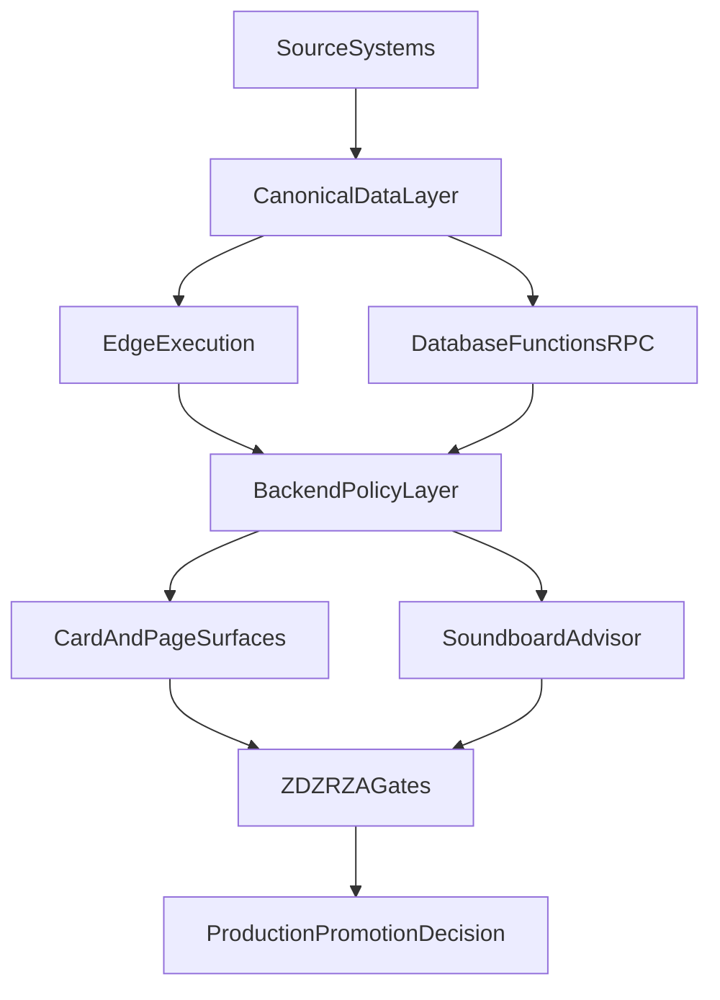

# Unified Platform Audit Execution Blueprint

## Objective

Execute a full production + staging audit for BIQc across storage, execution, backend, frontend, and advisor surfaces to achieve:
- top-tier cognition platform reliability,
- unified integration engine consistency,
- explainable and trusted operator guidance.

## Global Release Invariant (Non-Negotiable)

No release is permitted if any finance-facing card or Soundboard finance claim violates:
- reconciliation threshold policy,
- unresolved drift policy,
- evidence completeness policy.

This invariant is equal priority to ZD-ZR-ZA and cannot be downgraded.

## CFO Truth Control Policy (Numeric)

### Reconciliation thresholds
- Revenue/pipeline totals: absolute variance <= `0.5%` and <= `AUD 500` (both checks pass).
- Overdue invoice totals/counts: absolute variance <= `0.25%` and count delta <= `1`.
- Supplier payable totals: absolute variance <= `0.5%` and <= `AUD 500`.
- Cash-flow derived metrics: absolute variance <= `1.0%` and <= `AUD 1,000`.

### Breach behavior
- P0 breach: block release immediately.
- P1 breach: degrade non-critical cards to "stale/limited" state and require hotfix SLA.
- P2 breach: allow release with logged debt and scheduled remediation.

### Drift SLAs
- P0 finance drift: resolve <= `4 hours`.
- P1 finance drift: resolve <= `24 hours`.
- P2 finance drift: resolve <= `5 business days`.

## Strategic Build Path and Rationale

### Chosen Path

An **evidence-first, edge-orchestrated, policy-backed architecture**:
- Edge Functions for low-latency orchestration and integration abstraction.
- Database functions for heavy deterministic logic near data.
- Backend policy enforcement for identity, contracts, and compliance.
- Frontend cognition surfaces focused on action clarity and low cognitive load.

### Why This Path

- Fast enough for conversational advisory UX.
- Governable enough for legal/compliance accountability.
- Stable enough for multi-source data integration at scale.

### Alternatives Rejected

- Client-orchestrated integrations: weak security boundary, poor consistency.
- Single backend monolith for all flows: higher latency and larger failure domains.

## End-to-End Workstream

## Work Package A: Full Surface Inventory

### Deliverables

- Route-to-component inventory for all pages.
- Component-to-data-source mapping for every card.
- Backend endpoint catalog and edge function catalog.

### Acceptance

- Every user-facing card has a mapped backend and/or edge source.
- Unknown lineage count is zero before release.

## Work Package B: Contract Reliability Hardening

### Deliverables

- Endpoint contract matrix (per environment):
  - request type
  - expected success contract
  - allowed auth/validation contracts
  - failure escalation policy
- Edge function contract matrix for all deployed slugs.

### Acceptance

- No unexplained status classes in critical paths.
- Unexpected `5xx` count is zero in gate execution.
- Every failed checkpoint reports: `gate_id`, `failure_code`, and artifact link.

## Work Package C: CFO Source-of-Truth Controls

### Deliverables

- Authoritative finance mapping (accounting/ERP driven).
- Reconciliation checks for all finance-critical cards.
- Drift threshold policy and correction workflow.

### Acceptance

- CFO-critical metrics pass reconciliation in staging and production snapshots.
- Drift exceptions carry owner, SLA, and root-cause classification.
- Release blocks on any unresolved P0 finance drift/reconciliation breach.

## Work Package D: Security and Compliance Controls

### Deliverables

- Integration auth model inventory (OAuth/OIDC/token handling).
- Secret management and rotation control map.
- RBAC and least-privilege validation map.
- Explainability and audit log requirements per high-impact AI output.

### Acceptance

- No privileged key exposure in frontend surfaces.
- All production integrations have validated auth and permission scope.

## Work Package E: White-Label and Cognitive UX Quality

### Deliverables

- Supplier branding leak scan for user-visible copy.
- Cognitive load review checklist per role (CEO/CFO/COO/CMO/CIO/Legal).
- Card-level clarity and actionability scoring model.

### Acceptance

- No customer-visible supplier branding.
- Priority cards present concise guidance with explicit impact and next action.

## Work Package F: Soundboard AGI Capability Roadmap

### Milestone 1
- Streaming responses
- Conversation continuity
- Attribution baseline
- Coverage contract in every answer:
  - `coverage_start`
  - `coverage_end`
  - `last_sync_at`
  - `missing_periods`
  - `confidence_impact`

### Milestone 2
- Edit/regenerate flows
- Role-aware response adaptation
- Retrieval grounding controls
- Role-policy tests:
  - CFO mode: numeric strictness, source+period required.
  - Legal mode: constrained guidance; no over-assertive legal claims.
  - CEO mode: strategic abstraction with explicit source anchors.

### Milestone 3
- Multimodal ingestion (docs/CSV/voice)
- Citation panels linked to data sources and timestamps
- Scenario and risk simulation pathways

### Milestone 4
- Proactive alerting and decision support loops
- Human approval checkpoints for execution-triggering actions

## Work Package G: Innovation and Expansion

### Deliverables

- Connector expansion strategy (ERP, CRM, HRIS, payments, legal, analytics).
- Data platform expansion strategy (vector search, queues, time-series, auditing).
- Predictive analytics roadmap (forecasting, scenario planning, sensitivity/risk).

### Acceptance

- New connectors onboard through unified adapter model.
- New analytics features preserve explainability and governance standards.

## Operating Cadence

- Daily: contract and drift health checks.
- Weekly: advisor quality and cognitive-load review.
- Monthly: architecture and model governance review.
- Per release: full ZD-ZR-ZA gate evidence package.
- Post-release guard window: 24h automatic rollback triggers on CFO invariant breach.

## Gate Execution Topology

- PR: contract lint, schema checks, unit tests, white-label scan.
- Pre-merge: integration tests, role-policy checks, grounding benchmark.
- Pre-deploy: full ZD-ZR-ZA gate pack + CFO invariant checks.
- Post-deploy: golden journeys + canary + finance shadow validation.

## Override and Approval Policy

- P0: no single-person override; dual approval required (`Engineering DRI` + `CFO data owner`).
- Finance-related override requires explicit expiry and remediation ticket.
- If artifact upload fails or evidence is partial/stale, treat gate as failed.

## Evidence Integrity Contract

Required artifacts per release:
- contract test report,
- reconciliation report,
- drift report,
- grounding benchmark report,
- role-policy test report,
- golden-journey smoke report.

Evidence requirements:
- retention: `180 days`,
- hash/signature recorded per artifact,
- traceability from artifact -> gate decision -> release SHA,
- stale evidence timeout: `max 4 hours` at deploy decision time.

## Soundboard Quality Benchmarks (Release Targets)

- Grounded-answer benchmark >= `95%`.
- Hallucination/unsupported-claim rate <= `1%`.
- Citation precision >= `95%`, citation recall >= `90%`.
- Minimum source freshness for high-impact answers <= `24h` unless explicitly disclosed.

## Conversion Guardrails

- Upgrade prompts only when a missing integration or tier limit is the direct blocker to requested outcome.
- No upsell prompts during incident, risk, compliance, or legal-critical responses.

## Backfill and Incremental Sync SLOs

- Initial historical backfill completion target: <= `6 hours` per newly connected source.
- Incremental sync lag max: <= `15 minutes`.
- Retry policy: exponential backoff with max 5 retries, then dead-letter queue.
- Idempotency: required for all backfill and incremental writes (dedupe keys mandatory).
- Conflict precedence: accounting/ERP truth overrides derived caches.

## Phase Entry/Exit/Rollback Criteria

### Phase 1: White-label remediation
- Start when: baseline leak report exists.
- Done when: customer-visible leak count is zero on P0 surfaces.
- Rollback if: copy changes break route/render or integration status UX.

### Phase 2: Soundboard backend depth + grounding
- Start when: API contract for citations/coverage is frozen.
- Done when: quality benchmarks and role-policy tests pass.
- Rollback if: hallucination or unsupported-claim rate breaches thresholds.

### Phase 3: Soundboard UI redesign
- Start when: backend citation/coverage contract is stable.
- Done when: streaming latency, edit/regenerate reliability, and continuity restore targets pass.
- Rollback if: citation panel or continuity state regress.

### Phase 4: Full forensic validation + deploy readiness
- Start when: Phases 1-3 pass all P0 gates.
- Done when: canary + post-deploy guard window remains clean.
- Rollback if: any CFO invariant breach or missing evidence integrity.

## DRI Ownership

- Finance controls DRI: `TO_ASSIGN`.
- Evidence/gating DRI: `TO_ASSIGN`.
- Model quality DRI: `TO_ASSIGN`.
- Data sync/backfill DRI: `TO_ASSIGN`.
- Soundboard UI DRI: `TO_ASSIGN`.
- Infra scale/performance DRI: `TO_ASSIGN`.

## Executive Readout Format

- Current health by function (CEO/CFO/COO/CMO/CIO/Legal).
- P0/P1/P2 risk list with owner and SLA.
- Release recommendation: promote, hold, or rollback.
- Innovation increment readiness and expected business impact.
- Checkpoint line format: `PASS|FAIL`, `gate_id`, `failure_code(if fail)`, `artifact_link`.

